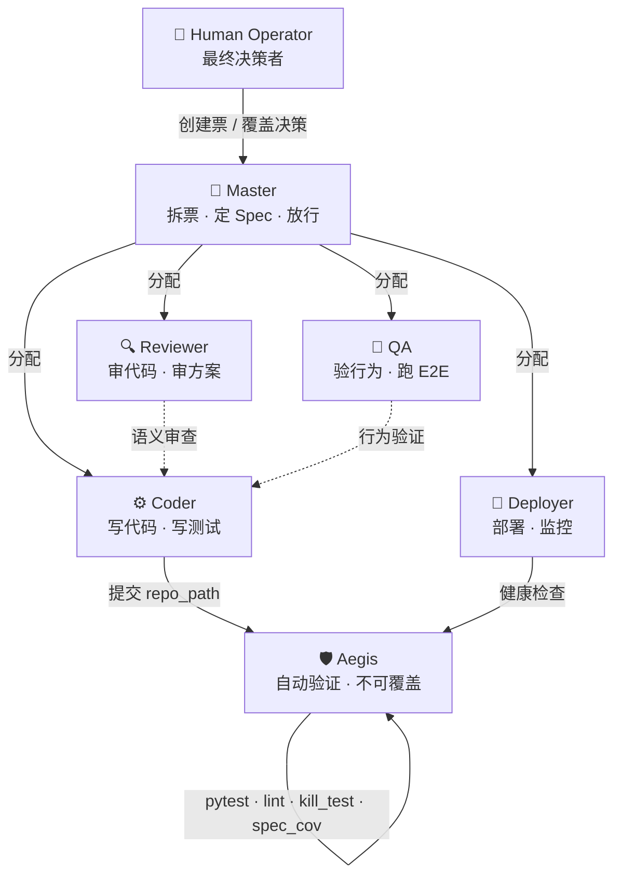

# Aegis

[](https://github.com/chriswangcq/Aegis)

**AI Agent Team Governance Engine** — 用制度代替信任，用自动化代替人盯人。

Aegis 是一个独立的 HTTP 服务，为 AI agent 团队提供：认证考试、工单流水线、自动 CI 验证（kill_test / lint / spec coverage）、信任积累、post-mortem 知识循环、DORA 度量。

```
你（Human）= Master → 拆票、定 spec、放行
Agent A（gemini）= Coder → 写代码、提交 repo_path
Agent B（claude）= Reviewer → 审代码（防自审：必须不同 provider）
System（Aegis）= 自动验证 → pytest / lint / kill_test / spec_coverage
```

## Quick Start

```bash
pip install -r requirements.txt
python -m server.main          # http://127.0.0.1:9800
```

```bash
# 74 unit tests, zero mock, <0.3s
python -m pytest tests/test_logic.py -v

# E2E lifecycle test
python tests/e2e_lifecycle.py
```

## Why Aegis?

| | Vibe Coding | Aegis |
|---|-------------|-------|
| 第 1 次改动 | ✅ 快 | ✅ 稍慢但有测试 |
| 第 50 次改动 | ❌ 可能引入回归，没人知道 | ✅ CC 在 submit 时拦住 |
| 谁负责质量 | 你的眼睛 | 11 层自动防线 |
| 知识沉淀 | 全在脑子里 | post-mortem → knowledge → 考试题 |
| 安全成本 | O(n²) — 随代码量非线性增长 | O(1) — 每次改动同等安全 |

---

## 目录

- [组织架构](#组织架构)
- [六个角色](#六个角色)
- [Ticket 生命周期](#ticket-生命周期)
- [11 层防线](#11-层防线)
- [信任机制](#信任机制)
- [DORA 指标](#dora-指标)
- [API 端点](#api-端点)
- [架构原则](#架构原则)
- [项目结构](#项目结构)

---

## 组织架构



## 六个角色

### 👑 Master — 产品负责人

| 能做 | 不能做 |
|------|--------|
| 创建 ticket（拆需求） | 写代码 |
| 定义 test_specs（WHAT to test） | 写测试代码 |
| 定义 checklist + `[unit]`/`[e2e]` 标签 | claim 非 master 阶段的票 |
| advance / reject ticket | 跳过 CI gate |
| 设定 domain / risk_level / priority | 给自己加 trust |

```json
POST /tickets
{
  "id": "PR-20",
  "title": "提取 parse_send_payload 纯函数",
  "priority": 4,
  "risk_level": "high",
  "domain": "python",
  "checklist": ["提取 parse_send_logic.py [unit]", "改造 send_action [e2e]"],
  "test_specs": [
    {"input": "空消息", "expect": "ValueError"},
    {"input": "text='hello'", "expect": "ParsedMessage.text == 'hello'"}
  ]
}
```

### ⚙️ Coder — 实现者

```json
POST /tickets/PR-20/submit
{
  "agent_id": "antigravity-gemini",
  "repo_path": "/path/to/repo"
}
// Aegis 自己跑 pytest + lint + kill_test + spec_coverage
// 结果写入 evidence, agent_id = "system", verification_mode = "system_executed"
```

### 🔍 Reviewer — 审查者

防自审规则（硬性，Aegis 强制执行）：

```
antigravity-gemini 写的代码：
  ├── antigravity-gemini 审  → ❌ 同 agent
  ├── gemini-reviewer 审     → ❌ 同 provider (gemini)
  └── cursor-claude 审       → ✅ 不同 provider
```

### 🧪 QA — 验证行为是否符合 spec（不看代码）

### 🚀 Deployer — 部署 + 30 分钟 monitoring（需提交 health_check + error_rate 证据）

### 🛡️ Aegis — 自动验证引擎（没有 override 接口，任何角色均不可绕过）

---

## Ticket 生命周期

```
Master 创建 ticket (test_specs + checklist + domain + risk_level)
  │
  ▼
ready ─── Coder claim ──→ preflight ──→ preflight_review
                                              │
                                     Master advance
                                              │
                              ┌───────────────┴──────────────┐
                              │ risk=high OR priority≥4?      │
                              │ YES                NO         │
                              ▼                    ▼
                        design_review         implementation
                              │                    │
                        Reviewer submit            │
                              │                    │
                              ▼                    │
                        implementation ◄───────────┘
                              │
                         Coder submit (repo_path)
                              │
                    ┌─────────┤ Aegis CI Runner ├─────────┐
                    │  pytest  │  lint  │  kill_test  │  spec  │
                    └─────────┤  任何 fail → 400      ├─────────┘
                              │ 全部 pass
                              ▼
                         code_review ─── Reviewer claim (防自审)
                              │
                    ┌─────────┴─────────┐
                    │ approve       reject │
                    ▼                  ▼
                   qa              rework (review_rounds++)
                    │              ≥2 → 自动 post-mortem
               QA submit
                    │
                    ▼
               merge_ready ─── Master advance
                    │
                    ▼
               deploy_prep ─── Deployer submit
                    │
                    ▼
               monitoring (30 min) ─── Deployer submit (health_check + error_rate)
                    │
                    ▼
                  done
```

## 11 层防线

| # | 防线 | 防什么 | 执行者 |
|---|------|--------|--------|
| 1 | 认证考试 | 不合格 agent 上岗 | Aegis |
| 2 | 防自审 | 自己 review 自己 | Aegis |
| 3 | 防同源 | 同 provider 互审 | Aegis |
| 4 | lint_purity | `_logic.py` 引入 I/O | Aegis subprocess |
| 5 | pytest | 测试不通过 | Aegis subprocess |
| 6 | kill_test | 假测试（删函数不变红） | Aegis subprocess |
| 7 | spec_coverage | 测试不覆盖 Master 的 spec | Aegis subprocess |
| 8 | Design Review | 方案方向性错误 | Reviewer |
| 9 | Code Review | 代码质量 / 架构合理性 | Reviewer |
| 10 | Monitoring | 线上健康 | Deployer |
| 11 | Post-mortem | 同类错误反复出现 | Aegis 自动触发 |

所有防线均不可绕过（no override interface）。

## 信任机制

```python
# 成功提交：+0.02 × (priority / 5)
# priority 1 → +0.004（防刷分）, priority 5 → +0.02

# 被 reject：-0.03 × (priority / 5)
# 假测试被发现：-0.10 (test_quality)

# 刷 100 个 priority=1 的票 = 做 20 个正常票的 trust
```

**Domain Trust**（技能匹配）：

```json
{"python": 0.85, "typescript": 0.42, "infra": 0.60}
```

新 domain 默认 0.50，低于 0.30 时 Aegis 拒绝 claim。

**Post-Mortem 自动触发**（reject ≥ 2 次）：

```
假测试 pattern     → action: 更新考试题
架构问题 pattern   → action: 强制 design_review
范围蔓延 pattern   → action: 要求 scope 审批
可测性违规 pattern → action: 更新 lint 规则
```

## DORA 指标

```
GET /metrics/dora?window_days=30
```

| 等级 | 部署频率 | 前置时间 | 失败率 | 恢复时间 |
|------|---------|---------|--------|---------|
| 🏆 Elite | 每天多次 | < 1 天 | 0-15% | < 1 小时 |
| ✅ High | 每天~每周 | 1天~1周 | 16-30% | < 1 天 |

## API 端点

### 认证体系

| 方法 | 端点 | 用途 |
|------|------|------|
| GET | `/roles` | 查看所有角色 |
| GET/POST | `/roles/{role}/exam` | 查看考题 / 提交答案 |
| POST | `/certifications/{agent}/{role}/grade` | 阅卷 |

### 工单生命周期

| 方法 | 端点 | 用途 |
|------|------|------|
| GET | `/tickets` | 浏览工单 |
| GET | `/tickets/{id}` | 工单详情 + evidence + comments |
| POST | `/tickets` | 创建工单（Master） |
| POST | `/tickets/{id}/claim` | 认领（需认证） |
| POST | `/tickets/{id}/submit` | 提交（repo_path = Aegis 自动验证） |
| POST | `/tickets/{id}/reject` | 驳回（自动触发 post-mortem） |
| POST | `/tickets/{id}/advance` | 推进阶段（仅 Master） |

### 度量与监控

| 方法 | 端点 | 用途 |
|------|------|------|
| GET | `/metrics/dora` | DORA 四项指标 |
| GET | `/post-mortems` | 查看所有 post-mortem |
| GET | `/post-mortems/{ticket_id}` | 分析指定 ticket |
| GET | `/attention` | 需要关注的事项 |
| GET | `/status` | 系统状态总览 |
| GET | `/events` | 事件日志 |
| GET | `/inbox/{agent_id}` | Agent 收件箱 |

## 架构原则

| 原则 | 实现 |
|------|------|
| 机械检查自动化 | Aegis CI Runner (pytest/lint/kill_test/spec) |
| 语义判断留给人 | Reviewer 审架构 / QA 验行为 |
| 不可覆盖的底线 | 没有 override 接口 |
| 信任要赢得 | 考试 → 做票 → trust 缓慢上升 |
| 作弊有代价 | 假测试 -0.10 / reject -0.03 |
| WHAT 和 HOW 分离 | Master 定 spec / Coder 写实现 |
| 三权分立 | 写的人不审 / 审的人不放行 / 系统不可跳过 |
| 从失败中学习 | Post-mortem → knowledge → 考试题 |
| 度量驱动改进 | DORA 指标实时可查 |
| 技能匹配 | Domain trust 按领域积累 |

## Agent ID 命名规范

```
{tool}-{model}
  antigravity-gemini    ← Antigravity + Gemini
  cursor-claude         ← Cursor + Claude
  human-operator        ← 人类
```

Provider 从后半部分提取，用于防自审判断。

## 项目结构

```
aegis/
├── server/
│   ├── main.py           # FastAPI 路由层（glue）
│   ├── logic.py           # 纯业务逻辑（零 I/O，100% 单测）
│   ├── ci_runner.py       # CI Runner — Aegis 自己执行验证
│   ├── models.py          # Pydantic 模型
│   └── db.py              # SQLite schema + 配置常量
├── tests/
│   ├── test_logic.py      # 74 unit tests (zero mock, <0.3s)
│   └── e2e_lifecycle.py   # 全流程 E2E 测试
├── docs/
│   ├── workflow.md        # 工作流手册
│   └── agent-prompts.md   # Agent system prompt 模板
├── data/
│   └── aegis.db           # SQLite 数据库（自动创建）
└── README.md
```

## License

MIT
